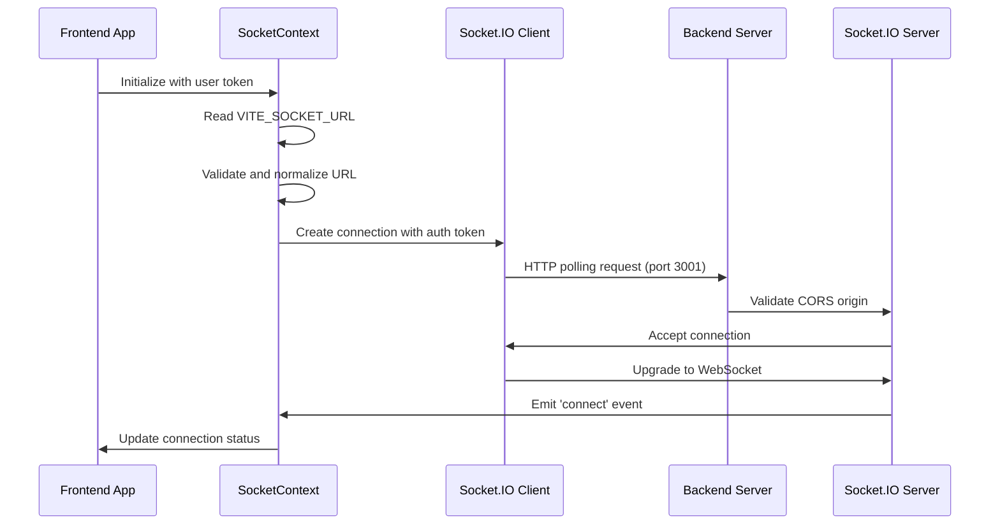
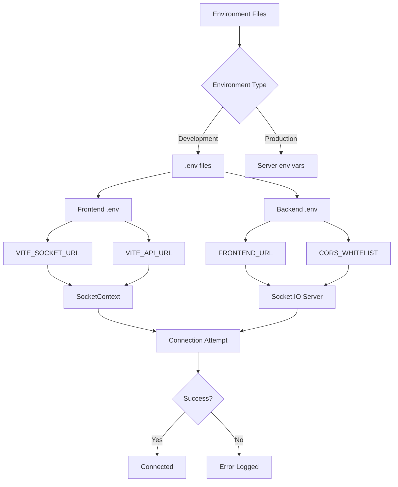

# Design Document: WebSocket Connection Fix

## Overview

This design addresses the "xhr poll error" issue preventing the frontend from establishing WebSocket connections to the backend. The root cause is a misconfigured `VITE_SOCKET_URL` environment variable in the frontend that lacks the port number, causing connection attempts to fail.

### Current State Analysis

**Backend Configuration:**
- Socket.IO server running on port 3001
- CORS configured with multiple origins
- Proper authentication middleware in place
- Socket initialization in `backend/src/lib/socket.ts`

**Frontend Configuration:**
- Socket.IO client in `frontend/src/contexts/SocketContext.tsx`
- Environment variable `VITE_SOCKET_URL=http://82.147.84.78` (missing port)
- Fallback to `VITE_API_URL=http://82.147.84.78:3001` exists but not properly utilized

**Problem:**
The frontend's `socketUrl` calculation removes `/api` suffix but doesn't ensure the port is included, resulting in connection attempts to `http://82.147.84.78` instead of `http://82.147.84.78:3001`.

## Architecture

### Component Interaction Flow



### Configuration Flow



## Components and Interfaces

### 1. Environment Configuration

#### Frontend Environment Variables

```typescript
// frontend/.env
interface FrontendEnv {
  VITE_API_URL: string;        // Full backend URL with port
  VITE_SOCKET_URL: string;     // Full WebSocket URL with port
  VITE_NODE_ENV: string;       // Environment mode
}

// Expected values for development:
// VITE_API_URL=http://82.147.84.78:3001
// VITE_SOCKET_URL=http://82.147.84.78:3001
// VITE_NODE_ENV=development
```

#### Backend Environment Variables

```typescript
// backend/.env
interface BackendEnv {
  PORT: number;                // Server port (3001)
  FRONTEND_URL: string;        // Frontend origin with protocol and port
  CORS_WHITELIST: string;      // Comma-separated list of allowed origins
  NODE_ENV: string;            // Environment mode
}

// Expected values for development:
// PORT=3001
// FRONTEND_URL=http://82.147.84.78:3000
// CORS_WHITELIST=http://82.147.84.78:3000,http://82.147.84.78:5173,http://82.147.84.78:3001
// NODE_ENV=development
```

### 2. Socket URL Normalization

#### Current Implementation (Problematic)

```typescript
const socketUrl = useMemo(() => {
  const raw = import.meta.env?.VITE_SOCKET_URL;
  const fallback = import.meta.env?.VITE_API_URL ?? '82.147.84.78';
  const normalized = String(raw ?? fallback).replace(/\/$/, '');
  return normalized.endsWith('/api') ? normalized.slice(0, -4) : normalized;
}, []);
```

**Issues:**
- Fallback to '82.147.84.78' string without protocol or port
- No validation of URL format
- No explicit port handling

#### Improved Implementation

```typescript
const socketUrl = useMemo(() => {
  // Priority: VITE_SOCKET_URL > VITE_API_URL > default
  const socketEnv = import.meta.env?.VITE_SOCKET_URL;
  const apiEnv = import.meta.env?.VITE_API_URL;
  
  let baseUrl: string;
  
  if (socketEnv && socketEnv.trim()) {
    baseUrl = socketEnv;
  } else if (apiEnv && apiEnv.trim()) {
    baseUrl = apiEnv;
  } else {
    // Development fallback with explicit port
    baseUrl = 'http://82.147.84.78:3001';
    console.warn('No VITE_SOCKET_URL or VITE_API_URL found, using fallback:', baseUrl);
  }
  
  // Remove trailing slash
  baseUrl = baseUrl.replace(/\/$/, '');
  
  // Remove /api suffix if present (Socket.IO connects to root)
  if (baseUrl.endsWith('/api')) {
    baseUrl = baseUrl.slice(0, -4);
  }
  
  // Validate URL format
  try {
    const url = new URL(baseUrl);
    console.log('Socket.IO connecting to:', url.toString());
    return url.toString();
  } catch (error) {
    console.error('Invalid socket URL:', baseUrl, error);
    return 'http://82.147.84.78:3001'; // Safe fallback
  }
}, []);
```

### 3. CORS Configuration Enhancement

#### Backend Socket.IO Initialization

```typescript
// backend/src/lib/socket.ts
export function initSocket(server: HttpServer, origins: string[]): SocketServer {
  if (!ioInstance) {
    // Normalize and validate origins
    const validOrigins = origins
      .filter(origin => origin && origin.trim())
      .map(origin => origin.trim());
    
    // Log configuration for debugging
    logger.info('Initializing Socket.IO with origins:', validOrigins);
    
    ioInstance = new SocketServer(server, {
      cors: {
        origin: validOrigins.length > 0 ? validOrigins : '*',
        methods: ['GET', 'POST'],
        credentials: true,
        allowedHeaders: ['Authorization', 'Content-Type'],
      },
      transports: ['websocket', 'polling'],
      pingTimeout: 60000,
      pingInterval: 25000,
      connectTimeout: 45000,
      allowEIO3: true,
    });
    
    // Log connection attempts for debugging
    ioInstance.on('connection', (socket) => {
      logger.info('Socket.IO connection established:', {
        socketId: socket.id,
        origin: socket.handshake.headers.origin,
        transport: socket.conn.transport.name
      });
    });
  }
  return ioInstance;
}
```

#### Backend Index.ts Configuration

```typescript
// backend/src/index.ts
const allowedOrigins = [
  env.FRONTEND_URL,
  'http://82.147.84.78:3000',
  'http://82.147.84.78:5173',
  'http://82.147.84.78:3001', // Allow backend itself for testing
].filter(Boolean).map(origin => {
  // Ensure protocol is included
  if (!origin.startsWith('http://') && !origin.startsWith('https://')) {
    return `http://${origin}`;
  }
  return origin;
});

const io = initSocket(server, allowedOrigins);
```

### 4. Connection Error Handling

#### Enhanced Error Logging

```typescript
// frontend/src/contexts/SocketContext.tsx
const handleError = (error: Error) => {
  const errorDetails = {
    message: error.message,
    socketUrl,
    timestamp: new Date().toISOString(),
    userAgent: navigator.userAgent,
    online: navigator.onLine
  };
  
  console.error('Socket.IO connection error:', errorDetails);
  setConnectionError(error.message);
  setStatus('error');
  
  // User-friendly error message
  if (!import.meta.env.PROD) {
    toast.error(`Ошибка подключения к серверу: ${error.message}`);
  }
};

const handleConnectError = (error: Error) => {
  console.error('Socket.IO connect_error:', {
    error: error.message,
    socketUrl,
    attempts: connectionAttempts + 1,
    timestamp: new Date().toISOString()
  });
  
  handleError(error);
};
```

#### Backend Connection Logging

```typescript
// backend/src/index.ts
io.on('connection', async (socket: AuthenticatedSocket) => {
  logger.info('Socket.IO connection attempt:', {
    socketId: socket.id,
    userId: socket.user?.id || 'anonymous',
    origin: socket.handshake.headers.origin,
    transport: socket.conn.transport.name,
    userAgent: socket.handshake.headers['user-agent']
  });
  
  // ... rest of connection handler
});

io.engine.on('connection_error', (err) => {
  logger.error('Socket.IO connection error:', {
    message: err.message,
    code: err.code,
    context: err.context
  });
});
```

## Data Models

### Connection State

```typescript
interface ConnectionState {
  status: 'connecting' | 'connected' | 'disconnected' | 'error';
  error: string | null;
  attempts: number;
  lastConnectedAt: number | null;
  socketUrl: string;
  transport: 'polling' | 'websocket' | null;
}
```

### Environment Configuration

```typescript
interface EnvironmentConfig {
  frontend: {
    apiUrl: string;
    socketUrl: string;
    nodeEnv: string;
  };
  backend: {
    port: number;
    frontendUrl: string;
    corsWhitelist: string[];
    nodeEnv: string;
  };
}
```

## Error Handling

### Error Categories

1. **Configuration Errors**
   - Missing environment variables
   - Invalid URL formats
   - Port mismatches

2. **Connection Errors**
   - CORS rejection
   - Network timeout
   - Authentication failure

3. **Runtime Errors**
   - Unexpected disconnection
   - Transport upgrade failure
   - Server unavailable

### Error Recovery Strategy

```typescript
interface ErrorRecoveryStrategy {
  configurationError: {
    action: 'log_and_fallback';
    fallback: 'http://82.147.84.78:3001';
    notify: 'developer_console';
  };
  connectionError: {
    action: 'retry_with_backoff';
    maxAttempts: 5;
    backoffMs: [2000, 4000, 8000, 16000, 32000];
    notify: 'user_toast_dev_only';
  };
  runtimeError: {
    action: 'reconnect_automatic';
    gracefulDegradation: true;
    notify: 'silent_log';
  };
}
```

### Graceful Degradation

The application should continue functioning even without WebSocket connection:

- Real-time updates disabled
- Polling fallback for critical data
- User notification of degraded mode
- Manual refresh option available

## Testing Strategy

### Unit Tests

1. **URL Normalization Tests**
   ```typescript
   describe('socketUrl normalization', () => {
     test('should use VITE_SOCKET_URL when available');
     test('should fallback to VITE_API_URL');
     test('should remove /api suffix');
     test('should handle missing protocol');
     test('should validate URL format');
   });
   ```

2. **CORS Configuration Tests**
   ```typescript
   describe('CORS configuration', () => {
     test('should accept whitelisted origins');
     test('should reject non-whitelisted origins');
     test('should handle 82.147.84.78 variations');
   });
   ```

### Integration Tests

1. **Connection Flow Tests**
   ```typescript
   describe('Socket.IO connection', () => {
     test('should connect with valid token');
     test('should handle connection errors gracefully');
     test('should reconnect after disconnect');
     test('should upgrade from polling to websocket');
   });
   ```

2. **Environment Configuration Tests**
   ```typescript
   describe('Environment configuration', () => {
     test('should load correct URLs in development');
     test('should load correct URLs in production');
     test('should validate required variables');
   });
   ```

### Manual Testing Checklist

- [ ] Frontend connects to backend on first load
- [ ] Connection survives page refresh
- [ ] Reconnection works after network interruption
- [ ] CORS errors are logged clearly
- [ ] Environment variables are validated on startup
- [ ] Error messages are user-friendly
- [ ] Connection status is visible in UI
- [ ] Graceful degradation works without connection

## Implementation Phases

### Phase 1: Environment Configuration Fix (Critical)
- Update `frontend/.env` with correct `VITE_SOCKET_URL`
- Validate `backend/.env` CORS configuration
- Add environment variable validation

### Phase 2: URL Normalization Enhancement
- Improve `socketUrl` calculation in SocketContext
- Add URL validation and error handling
- Implement proper fallback logic

### Phase 3: Logging and Monitoring
- Add detailed connection logging
- Implement error tracking
- Add connection status monitoring

### Phase 4: Testing and Validation
- Write unit tests for URL normalization
- Add integration tests for connection flow
- Perform manual testing across scenarios

## Configuration Examples

### Development Environment

```env
# frontend/.env
VITE_API_URL=http://82.147.84.78:3001
VITE_SOCKET_URL=http://82.147.84.78:3001
VITE_NODE_ENV=development

# backend/.env
PORT=3001
FRONTEND_URL=http://82.147.84.78:3000
CORS_WHITELIST=http://82.147.84.78:3000,http://82.147.84.78:5173,http://82.147.84.78:3001
NODE_ENV=development
```

### Production Environment

```env
# frontend/.env
VITE_API_URL=https://api.example.com
VITE_SOCKET_URL=https://api.example.com
VITE_NODE_ENV=production

# backend/.env
PORT=3001
FRONTEND_URL=https://example.com
CORS_WHITELIST=https://example.com,https://www.example.com
NODE_ENV=production
```

## Security Considerations

1. **CORS Validation**: Strict origin checking in production
2. **Token Authentication**: JWT validation for all socket connections
3. **Rate Limiting**: Connection attempt limits to prevent abuse
4. **Error Information**: Minimal error details in production
5. **Logging**: Sanitize sensitive data in logs

## Performance Considerations

1. **Connection Pooling**: Reuse existing connections
2. **Transport Upgrade**: Prefer WebSocket over polling
3. **Reconnection Strategy**: Exponential backoff to reduce server load
4. **Heartbeat Optimization**: Balanced ping intervals
5. **Memory Management**: Proper cleanup on disconnect
