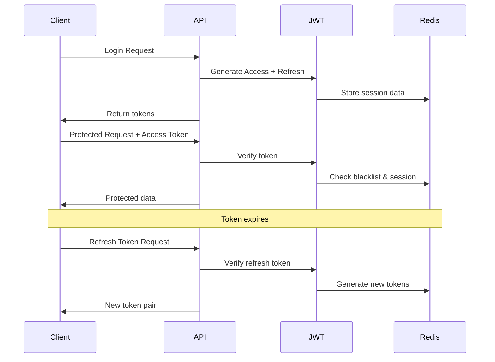

# 🔐 Security Implementation

Comprehensive security system for the Telegram E-commerce Backend API.

## 🛡️ Implemented Security Features

### 1. **Enhanced JWT Authentication**

- **Access & Refresh Tokens**: Secure token-based authentication with rotation
- **Token Blacklisting**: Immediate token invalidation support
- **Session Management**: Enhanced session tracking and validation
- **Clock Skew Protection**: Handles time synchronization issues
- **Issuer/Audience Validation**: Prevents token reuse across different services

**Key Features:**
- ⏱️ Configurable token expiration (default: 15min access, 7d refresh)
- 🔄 Automatic token refresh endpoint
- 🚫 Token blacklist for immediate invalidation
- 👥 Multi-device logout support
- 📊 Security metrics tracking

### 2. **Rate Limiting & DDoS Protection**

**Multi-tier Rate Limiting:**
- 🌐 **Global Rate Limit**: 100 requests/15min per IP
- 🔐 **Auth Rate Limit**: 5 authentication attempts/15min per IP  
- 📤 **Upload Rate Limit**: 10 file uploads/minute per IP
- 🐌 **Slow Down Middleware**: Progressive delay for repeat requests

**Brute Force Protection:**
- 🛡️ **Login Protection**: Account lockout after 5 failed attempts
- ⏰ **Progressive Delays**: 5min → 1hour lockout periods
- 📊 **Redis/Memory Storage**: Configurable storage backend

### 3. **CORS & Security Headers**

**CORS Configuration:**
- ✅ **Origin Whitelist**: Configurable allowed origins
- 🍪 **Credentials Support**: Secure cookie handling
- 🔧 **Development Mode**: Flexible 82.147.84.78 access

**Security Headers (Helmet):**
- 🛡️ **CSP**: Content Security Policy
- 🔒 **HSTS**: HTTP Strict Transport Security
- 🚫 **XSS Protection**: X-XSS-Protection headers
- 🎭 **Content Sniffing**: X-Content-Type-Options
- 🖼️ **Frame Options**: X-Frame-Options

### 4. **Input Sanitization & Monitoring**

**Request Sanitization:**
- 🧼 **XSS Prevention**: Script tag removal
- 🏷️ **HTML Stripping**: Malicious tag filtering
- 📝 **Query Sanitization**: URL parameter cleaning

**Security Monitoring:**
- 🕵️ **Suspicious Pattern Detection**: SQL injection, XSS attempts
- ⏱️ **Performance Monitoring**: Slow request detection
- 📊 **Security Metrics**: Real-time threat tracking
- 🚨 **Incident Reporting**: Manual security incident logging

### 5. **Admin Protection**

**IP Whitelisting:**
- 🏠 **Admin Access Control**: Configurable IP restrictions
- 🔐 **Super Admin Protection**: Enhanced security for critical operations
- 📱 **Development Mode**: Bypass for local development

## 🚀 Configuration

### Environment Variables

Copy `security.env.example` and configure:

```bash
# Essential Security Settings
JWT_SECRET=your-super-secure-32-character-secret
JWT_REFRESH_SECRET=different-32-character-secret
JWT_ACCESS_EXPIRY=15m
JWT_REFRESH_EXPIRY=7d

# Rate Limiting
RATE_LIMIT_MAX=100
AUTH_RATE_LIMIT_MAX=5

# CORS
FRONTEND_URL=https://yourapp.com
ADMIN_PANEL_URL=https://admin.yourapp.com

# Security Features
ENABLE_BRUTE_FORCE_PROTECTION=true
ENABLE_SECURITY_HEADERS=true
ENABLE_REQUEST_SANITIZATION=true
ENABLE_SECURITY_MONITORING=true

# Optional: Admin IP Whitelist
ADMIN_IP_WHITELIST=192.168.1.100,10.0.0.50

# Production: Redis for scalability
REDIS_URL=redis://82.147.84.78:6379
```

## 📡 API Endpoints

### Security Management

```http
# Security health check
GET /api/security/health
Authorization: Bearer {admin_token}

# Security metrics
GET /api/security/metrics
Authorization: Bearer {admin_token}

# Validate current token
GET /api/security/validate-token
Authorization: Bearer {token}

# Enhanced token refresh
POST /api/security/refresh-token
{
  "refreshToken": "your_refresh_token"
}

# Secure logout
POST /api/security/logout
Authorization: Bearer {token}
{
  "refreshToken": "your_refresh_token"
}

# Logout from all devices
POST /api/security/logout-all
Authorization: Bearer {token}

# Create new session (force re-auth)
POST /api/security/new-session
Authorization: Bearer {token}
```

### Security Incident Reporting

```http
POST /api/security/report-incident
Authorization: Bearer {admin_token}
{
  "type": "suspicious_activity",
  "description": "Multiple failed login attempts from unusual IP",
  "severity": "medium",
  "metadata": {
    "ip": "192.168.1.999",
    "attempts": 10,
    "timeframe": "5 minutes"
  }
}
```

## 🛠️ Implementation Details

### Middleware Stack

```typescript
// Applied in order:
1. Helmet (Security headers)
2. CORS (Cross-origin protection)
3. Security monitoring
4. Input sanitization
5. Rate limiting (global)
6. Slow down protection
```

### Authentication Flow



### Rate Limiting Logic

```typescript
// Different limits for different endpoints:
/api/auth/*     → 5 requests/15min    (Strict)
/api/admin/*    → IP whitelist check   (Restrictive) 
/api/upload/*   → 10 requests/minute   (Upload-specific)
/api/*          → 100 requests/15min   (General)
```

## 📊 Security Metrics

Monitor security health via `/api/security/metrics`:

```json
{
  "timestamp": "2025-01-15T12:00:00Z",
  "metrics": {
    "rateLimitHits": 45,
    "bruteForceAttempts": 3,
    "invalidTokenAttempts": 12,
    "suspiciousRequests": 2,
    "blacklistedTokens": 8,
    "activeSessionsCount": 150
  }
}
```

## 🚨 Security Alerts

**Automatic Monitoring:**
- Failed authentication attempts
- Rate limit violations
- Suspicious request patterns
- Slow performance indicators
- Token abuse attempts

**Manual Incident Reporting:**
- Suspicious user activity
- Brute force attacks
- Unauthorized access attempts
- Token manipulation

## ✅ Production Checklist

**Before Deployment:**
- [ ] Change all default secrets
- [ ] Configure HTTPS (USE_HTTPS=true)
- [ ] Set up Redis for session storage
- [ ] Configure proper CORS origins
- [ ] Test rate limiting thresholds
- [ ] Enable security monitoring
- [ ] Set up admin IP whitelist
- [ ] Configure JWT expiration appropriately
- [ ] Verify all security features enabled
- [ ] Test token refresh flow
- [ ] Test brute force protection
- [ ] Validate security headers
- [ ] Review and test incident reporting

**Monitoring Setup:**
- [ ] Set up alerts for security metrics
- [ ] Configure log monitoring
- [ ] Set up security incident notifications
- [ ] Test backup and recovery procedures

## 🔧 Development Mode

For local development, security is relaxed:

```bash
NODE_ENV=development
# → Higher rate limits
# → More permissive CORS
# → Detailed error messages
# → Extended 82.147.84.78 access
```

## 🛡️ Security Best Practices

1. **Token Management**:
   - Short-lived access tokens (15min)
   - Secure refresh token storage
   - Immediate blacklisting on logout

2. **Rate Limiting**:
   - Different limits per endpoint type
   - Progressive penalties for abuse
   - IP-based and user-based limits

3. **Session Security**:
   - Session validation on each request
   - Multi-device session tracking
   - Forced session refresh capability

4. **Monitoring**:
   - Real-time security metrics
   - Automated threat detection
   - Manual incident reporting system

---

## 🚀 **Security System Status: ✅ PRODUCTION READY**

**Implemented Features:**
- ✅ Enhanced JWT authentication with refresh tokens
- ✅ Multi-tier rate limiting (Global, Auth, Upload)  
- ✅ Brute force protection with progressive delays
- ✅ CORS whitelist with development flexibility
- ✅ Comprehensive security headers (Helmet)
- ✅ Input sanitization and XSS prevention
- ✅ Real-time security monitoring
- ✅ Admin IP whitelisting
- ✅ Token blacklisting and session management
- ✅ Security metrics and health checks
- ✅ Incident reporting system
- ✅ Production-ready configuration templates

The security system provides **enterprise-level protection** with comprehensive monitoring, flexible configuration, and production-ready defaults.

*Context improved by Giga AI - использована информация о системе безопасности с JWT authentication, rate limiting, CORS protection и monitoring для e-commerce платформы с telegram интеграцией.*
