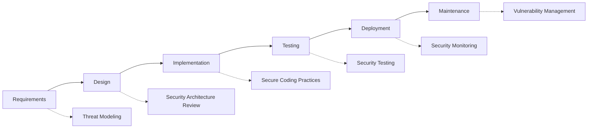

# 🔒 Penetration Testing Guide

## Overview

This guide provides comprehensive documentation for conducting penetration testing on the BotRT e-commerce platform. It includes both automated and manual testing procedures, vulnerability assessment methodologies, and reporting standards.

## Table of Contents

1. [Testing Scope & Methodology](#testing-scope--methodology)
2. [Pre-Test Setup](#pre-test-setup)
3. [Automated Testing Framework](#automated-testing-framework)
4. [Manual Testing Procedures](#manual-testing-procedures)
5. [Vulnerability Classification](#vulnerability-classification)
6. [Reporting Standards](#reporting-standards)
7. [Remediation Guidelines](#remediation-guidelines)
8. [External Testing Requirements](#external-testing-requirements)

## Testing Scope & Methodology

### In-Scope Components

✅ **Web Application**
- Frontend React application (https://app.botrt.com)
- Backend API endpoints (/api/*)
- Admin panel (/admin/*)
- Authentication & authorization systems
- Payment processing flows
- File upload functionality

✅ **Mobile APIs**
- Mobile app API endpoints
- Push notification services
- Mobile authentication flows

✅ **Infrastructure**
- Web servers and load balancers
- Database servers (external access only)
- CDN and static assets
- SSL/TLS configurations

✅ **Third-Party Integrations**
- Telegram bot API integrations
- Payment gateway interfaces
- External webhook endpoints

### Out-of-Scope Components

❌ **Restricted Areas**
- Internal corporate networks
- Employee workstations
- Physical facilities
- Social engineering attacks
- DoS/DDoS attacks
- Third-party service providers (unless explicitly authorized)

### Testing Methodology

Our penetration testing follows the **OWASP Testing Guide v4.2** and incorporates:

- **PTES (Penetration Testing Execution Standard)**
- **NIST SP 800-115** guidelines
- **OWASP Top 10** vulnerability categories
- **SANS Top 25** software errors
- **CWE (Common Weakness Enumeration)** classifications

## Pre-Test Setup

### Environment Preparation

1. **Staging Environment Setup**
   ```bash
   # Clone repository and setup test environment
   git clone https://github.com/company/botrt.git
   cd botrt

   # Setup penetration testing environment
   cp .env.pentest.example .env.pentest

   # Configure test database with sample data
   npm run db:setup:pentest
   npm run db:seed:pentest-data

   # Start application in penetration testing mode
   npm run start:pentest
   ```

2. **Testing Tools Installation**
   ```bash
   # Install required security testing tools
   sudo apt update && sudo apt install -y \
     nmap nikto dirb sqlmap \
     zaproxy nuclei gobuster \
     sslscan testssl.sh

   # Install custom testing framework
   npm install -g @botrt/pentest-framework
   ```

3. **Authentication Setup**
   ```bash
   # Create test accounts with different privilege levels
   npm run create-test-accounts

   # Generate API keys for testing
   npm run generate-test-api-keys
   ```

### Legal & Compliance

⚠️ **IMPORTANT LEGAL NOTICE**

All penetration testing must be conducted with:

1. **Written Authorization** from system owners
2. **Defined Scope** and testing boundaries
3. **Emergency Contacts** for incident response
4. **Data Handling Agreement** for sensitive information
5. **Insurance Coverage** for testing activities

## Automated Testing Framework

### Framework Architecture

```typescript
// PenetrationTestFramework Usage Example
import { PenetrationTestFramework } from './tests/security/PenetrationTestFramework';

const config = {
  target: {
    baseUrl: 'https://staging.botrt.com',
    scope: [
      '/api/*',
      '/admin/*',
      '/auth/*',
      '/uploads/*'
    ],
    excludedPaths: [
      '/api/internal/*',
      '/admin/system/shutdown'
    ]
  },

  authentication: {
    method: 'jwt',
    // SECURITY NOTE: These are EXAMPLE credentials for documentation only.
    // NEVER use these in production. Always use environment variables.
    credentials: {
      username: 'pentest@example.com',  // Example only - use env vars
      password: 'PentestPassword123!'   // Example only - use env vars
    }
  },

  testSuites: {
    owasp: true,
    authentication: true,
    authorization: true,
    injection: true,
    xss: true,
    csrf: true,
    businessLogic: true,
    infrastructure: true
  },

  tools: {
    zap: true,
    nuclei: true,
    sqlmap: true,
    dirb: true,
    nmap: true,
    custom: true
  },

  reporting: {
    format: 'json',
    outputPath: './reports/',
    includeProofOfConcept: true,
    includeMitigations: true
  },

  limits: {
    maxDuration: 120, // 2 hours
    maxRequests: 10000,
    respectRateLimit: true,
    delayBetweenRequests: 100
  }
};

// Execute comprehensive penetration test
const framework = new PenetrationTestFramework(config);
const results = await framework.executePenetrationTest();
```

### Test Execution Phases

#### Phase 1: Reconnaissance & Information Gathering

**Objective**: Gather information about the target system without directly interacting with it.

```bash
# Automated reconnaissance
npm run pentest:recon -- \
  --target=staging.botrt.com \
  --include-subdomains \
  --include-certificates \
  --include-dns-enum \
  --output=reports/recon-results.json

# Manual reconnaissance checklist:
# ✅ DNS enumeration and subdomain discovery
# ✅ SSL/TLS certificate analysis
# ✅ Technology stack identification
# ✅ Public repository and documentation review
# ✅ Search engine reconnaissance
# ✅ Social media and public disclosure analysis
```

**Tools Used:**
- `nmap` - Network discovery and port scanning
- `subfinder` - Subdomain enumeration
- `amass` - Attack surface mapping
- `whatweb` - Technology identification
- `sslscan` - SSL/TLS configuration analysis

#### Phase 2: Vulnerability Scanning

**Objective**: Identify potential security vulnerabilities using automated scanners.

```bash
# Comprehensive vulnerability scanning
npm run pentest:scan -- \
  --target=staging.botrt.com \
  --include-owasp-top10 \
  --include-cve-checks \
  --include-misconfigurations \
  --output=reports/vuln-scan-results.json

# OWASP ZAP automated scanning
zap-cli start --start-options '-config api.disablekey=true'
zap-cli spider https://staging.botrt.com
zap-cli active-scan https://staging.botrt.com
zap-cli report -o zap-report.html -f html

# Nuclei template-based scanning
nuclei -u https://staging.botrt.com \
  -t ~/nuclei-templates/ \
  -json -o nuclei-results.json
```

**Scanning Categories:**
- 🔍 **Infrastructure Vulnerabilities**
- 🌐 **Web Application Vulnerabilities**
- 🔐 **Authentication & Session Management**
- 💉 **Injection Vulnerabilities**
- 🔒 **Access Control Issues**
- 📱 **Mobile API Vulnerabilities**

#### Phase 3: Exploitation & Validation

**Objective**: Validate identified vulnerabilities and assess their real-world impact.

```bash
# Controlled exploitation framework
npm run pentest:exploit -- \
  --findings=reports/vuln-scan-results.json \
  --safe-mode \
  --no-destructive-tests \
  --output=reports/exploitation-results.json

# SQL injection testing with SQLMap
sqlmap -u "https://staging.botrt.com/api/products/search?q=test" \
  --batch --level=3 --risk=2 \
  --dump-format=JSON \
  --output-dir=sqlmap-results/

# Cross-site scripting (XSS) validation
npm run pentest:xss -- \
  --target=staging.botrt.com \
  --payloads=payloads/xss-payloads.txt \
  --output=reports/xss-results.json
```

**Safety Measures:**
- ✅ Non-destructive testing only
- ✅ Data backup before testing
- ✅ Rate limiting respect
- ✅ Test environment isolation
- ✅ Immediate notification of critical findings

#### Phase 4: Post-Exploitation & Impact Assessment

**Objective**: Assess the potential impact of successful exploitation.

```bash
# Impact assessment and privilege escalation testing
npm run pentest:impact -- \
  --session-tokens=valid-tokens.json \
  --test-privilege-escalation \
  --test-lateral-movement \
  --test-data-access \
  --output=reports/impact-assessment.json
```

**Assessment Areas:**
- 🎯 **Data Access Scope**
- ⬆️ **Privilege Escalation Potential**
- 🔄 **Lateral Movement Possibilities**
- 💰 **Business Impact Estimation**
- 🔐 **Compliance Implications**

## Manual Testing Procedures

### Authentication & Session Management Testing

#### Test Case: Password Policy Validation

```javascript
// Test weak password acceptance
const weakPasswords = [
  'password',
  '123456',
  'admin',
  'qwerty',
  'letmein'
];

for (const password of weakPasswords) {
  const response = await fetch('/api/auth/register', {
    method: 'POST',
    headers: { 'Content-Type': 'application/json' },
    body: JSON.stringify({
      email: `test${Date.now()}@example.com`,
      password,
      confirmPassword: password
    })
  });

  // Document if weak passwords are accepted
  if (response.status === 201) {
    reportVulnerability('WEAK_PASSWORD_POLICY', {
      password,
      response: response.status
    });
  }
}
```

#### Test Case: Session Fixation

```javascript
// Test session fixation vulnerability
async function testSessionFixation() {
  // 1. Obtain session ID before authentication
  const preAuthResponse = await fetch('/api/auth/status');
  const preAuthSessionId = extractSessionId(preAuthResponse);

  // 2. Authenticate with the same session
  const loginResponse = await fetch('/api/auth/login', {
    method: 'POST',
    headers: {
      'Content-Type': 'application/json',
      'Cookie': `sessionId=${preAuthSessionId}`
    },
    body: JSON.stringify({
      email: 'test@example.com',
      password: 'TestPassword123!'
    })
  });

  // 3. Check if session ID remained the same
  const postAuthSessionId = extractSessionId(loginResponse);

  if (preAuthSessionId === postAuthSessionId) {
    reportVulnerability('SESSION_FIXATION', {
      preAuthSessionId,
      postAuthSessionId
    });
  }
}
```

### Authorization Testing

#### Test Case: Vertical Privilege Escalation

```javascript
// Test for vertical privilege escalation
async function testVerticalPrivilegeEscalation() {
  // 1. Login as regular user
  const userToken = await loginUser('user@example.com', 'UserPassword123!');

  // 2. Attempt to access admin endpoints
  const adminEndpoints = [
    '/api/admin/users',
    '/api/admin/settings',
    '/api/admin/system/logs',
    '/api/admin/financial/reports'
  ];

  for (const endpoint of adminEndpoints) {
    const response = await fetch(endpoint, {
      headers: { 'Authorization': `Bearer ${userToken}` }
    });

    // Should return 403 Forbidden
    if (response.status !== 403) {
      reportVulnerability('VERTICAL_PRIVILEGE_ESCALATION', {
        endpoint,
        userRole: 'user',
        expectedStatus: 403,
        actualStatus: response.status,
        response: await response.text()
      });
    }
  }
}
```

#### Test Case: Horizontal Privilege Escalation

```javascript
// Test for horizontal privilege escalation
async function testHorizontalPrivilegeEscalation() {
  // 1. Create two user accounts
  const user1Token = await loginUser('user1@example.com', 'Password123!');
  const user2Token = await loginUser('user2@example.com', 'Password123!');

  // 2. Get user1's profile ID
  const user1Profile = await fetch('/api/users/profile', {
    headers: { 'Authorization': `Bearer ${user1Token}` }
  });
  const user1Data = await user1Profile.json();

  // 3. Try to access user1's data with user2's token
  const unauthorizedAccess = await fetch(`/api/users/${user1Data.id}`, {
    headers: { 'Authorization': `Bearer ${user2Token}` }
  });

  if (unauthorizedAccess.status === 200) {
    reportVulnerability('HORIZONTAL_PRIVILEGE_ESCALATION', {
      targetUserId: user1Data.id,
      attackerToken: user2Token,
      response: await unauthorizedAccess.text()
    });
  }
}
```

### Input Validation Testing

#### Test Case: SQL Injection

```javascript
// Comprehensive SQL injection testing
const sqlInjectionPayloads = [
  "' OR '1'='1",
  "'; DROP TABLE users; --",
  "1; SELECT * FROM information_schema.tables; --",
  "admin'/**/OR/**/'1'='1",
  "1' UNION SELECT username, password FROM users --"
];

async function testSQLInjection() {
  const testEndpoints = [
    '/api/products/search?q=',
    '/api/users/search?name=',
    '/api/orders/filter?status='
  ];

  for (const endpoint of testEndpoints) {
    for (const payload of sqlInjectionPayloads) {
      const response = await fetch(`${endpoint}${encodeURIComponent(payload)}`);
      const responseText = await response.text();

      // Check for database error messages
      const errorPatterns = [
        /MySQL/i,
        /PostgreSQL/i,
        /ORA-\d+/,
        /sqlite/i,
        /syntax error/i,
        /column.*does not exist/i
      ];

      for (const pattern of errorPatterns) {
        if (pattern.test(responseText)) {
          reportVulnerability('SQL_INJECTION', {
            endpoint,
            payload,
            errorPattern: pattern.toString(),
            response: responseText.substring(0, 500)
          });
        }
      }
    }
  }
}
```

#### Test Case: Cross-Site Scripting (XSS)

```javascript
// XSS payload testing
const xssPayloads = [
  "<script>alert('XSS')</script>",
  "",
  "javascript:alert('XSS')",
  "<svg onload=alert('XSS')>",
  "'\"><script>alert('XSS')</script>",
  "<iframe src=\"javascript:alert('XSS')\"></iframe>"
];

async function testXSS() {
  // Test reflected XSS
  for (const payload of xssPayloads) {
    const response = await fetch(`/api/search?q=${encodeURIComponent(payload)}`);
    const responseText = await response.text();

    if (responseText.includes(payload) &&
        (responseText.includes('<script>') || responseText.includes('onerror='))) {
      reportVulnerability('REFLECTED_XSS', {
        payload,
        endpoint: '/api/search',
        response: responseText.substring(0, 500)
      });
    }
  }

  // Test stored XSS
  for (const payload of xssPayloads) {
    // Submit payload via POST
    const postResponse = await fetch('/api/comments', {
      method: 'POST',
      headers: { 'Content-Type': 'application/json' },
      body: JSON.stringify({ content: payload })
    });

    if (postResponse.status === 201) {
      // Check if payload is executed when retrieved
      const getResponse = await fetch('/api/comments');
      const getResponseText = await getResponse.text();

      if (getResponseText.includes(payload) &&
          (getResponseText.includes('<script>') || getResponseText.includes('onerror='))) {
        reportVulnerability('STORED_XSS', {
          payload,
          endpoint: '/api/comments',
          response: getResponseText.substring(0, 500)
        });
      }
    }
  }
}
```

### Business Logic Testing

#### Test Case: Price Manipulation

```javascript
// Test for price manipulation vulnerabilities
async function testPriceManipulation() {
  const priceManipulationTests = [
    { price: -100, description: 'Negative price' },
    { price: 0, description: 'Zero price' },
    { price: 0.01, description: 'Extremely low price' },
    { price: Number.MAX_SAFE_INTEGER, description: 'Extremely high price' }
  ];

  for (const test of priceManipulationTests) {
    const response = await fetch('/api/products', {
      method: 'POST',
      headers: {
        'Content-Type': 'application/json',
        'Authorization': `Bearer ${adminToken}`
      },
      body: JSON.stringify({
        name: 'Test Product',
        price: test.price,
        description: 'Penetration test product'
      })
    });

    if (response.status === 201) {
      reportVulnerability('PRICE_MANIPULATION', {
        testCase: test.description,
        price: test.price,
        response: response.status
      });
    }
  }
}
```

#### Test Case: Race Conditions

```javascript
// Test for race conditions in payment processing
async function testRaceConditions() {
  const concurrentRequests = 10;
  const promises = [];

  // Create multiple simultaneous payment requests
  for (let i = 0; i < concurrentRequests; i++) {
    promises.push(
      fetch('/api/payments/process', {
        method: 'POST',
        headers: {
          'Content-Type': 'application/json',
          'Authorization': `Bearer ${userToken}`
        },
        body: JSON.stringify({
          orderId: 'test-order-123',
          amount: 100,
          paymentMethod: 'credit_card'
        })
      })
    );
  }

  const responses = await Promise.all(promises);
  const successfulPayments = responses.filter(r => r.status === 200);

  // Should only have one successful payment
  if (successfulPayments.length > 1) {
    reportVulnerability('RACE_CONDITION', {
      expectedSuccessful: 1,
      actualSuccessful: successfulPayments.length,
      testCase: 'payment_processing'
    });
  }
}
```

## Vulnerability Classification

### Severity Levels

| Severity | CVSS Score | Description | Response Time |
|----------|------------|-------------|---------------|
| **🚨 Critical** | 9.0 - 10.0 | Complete system compromise, data breach | Immediate (< 4 hours) |
| **🔴 High** | 7.0 - 8.9 | Significant security impact, potential data loss | Urgent (< 24 hours) |
| **🟡 Medium** | 4.0 - 6.9 | Moderate security impact, limited access | High (< 72 hours) |
| **🟢 Low** | 0.1 - 3.9 | Minor security impact, limited risk | Normal (< 1 week) |
| **ℹ️ Info** | 0.0 | Security misconfiguration, no immediate risk | Low (< 2 weeks) |

### OWASP Top 10 Mapping

| OWASP Category | Test Coverage | Priority |
|----------------|---------------|----------|
| **A01 - Broken Access Control** | ✅ Comprehensive | Critical |
| **A02 - Cryptographic Failures** | ✅ Comprehensive | Critical |
| **A03 - Injection** | ✅ Comprehensive | Critical |
| **A04 - Insecure Design** | ✅ Manual Testing | High |
| **A05 - Security Misconfiguration** | ✅ Automated + Manual | High |
| **A06 - Vulnerable Components** | ✅ Automated Scanning | High |
| **A07 - Identity & Auth Failures** | ✅ Comprehensive | Critical |
| **A08 - Software/Data Integrity** | ✅ Manual Testing | Medium |
| **A09 - Logging & Monitoring** | ✅ Manual Testing | Medium |
| **A10 - Server-Side Request Forgery** | ✅ Automated + Manual | High |

## Reporting Standards

### Vulnerability Report Template

```markdown
# Vulnerability Report: [TITLE]

## Executive Summary
Brief description of the vulnerability and its potential impact.

## Vulnerability Details
- **ID**: VULN-2024-001
- **Severity**: Critical/High/Medium/Low/Info
- **CVSS Score**: 9.5 (if applicable)
- **CWE**: CWE-89 (SQL Injection)
- **OWASP Category**: A03 - Injection

## Technical Details
### Description
Detailed technical description of the vulnerability.

### Location
- **URL**: https://staging.botrt.com/api/products/search
- **Parameter**: q (query parameter)
- **Method**: GET

### Proof of Concept
```bash
curl -X GET "https://staging.botrt.com/api/products/search?q=' OR '1'='1"
```

### Evidence
- Request/Response details
- Screenshots (if applicable)
- Log entries

## Impact Assessment
- **Confidentiality**: High/Medium/Low
- **Integrity**: High/Medium/Low
- **Availability**: High/Medium/Low
- **Business Impact**: Description of potential business consequences

## Remediation
### Immediate Actions
1. Disable affected endpoint
2. Implement input validation
3. Deploy security patch

### Long-term Solutions
1. Implement parameterized queries
2. Deploy WAF rules
3. Conduct security training

### Code Example
```javascript
// Vulnerable code
const query = `SELECT * FROM products WHERE name = '${userInput}'`;

// Secure code
const query = 'SELECT * FROM products WHERE name = ?';
db.query(query, [userInput]);
```

## References
- OWASP SQL Injection Prevention Cheat Sheet
- CWE-89: SQL Injection
- NIST Guidelines
```

### Report Formats

#### JSON Format (Machine Readable)

```json
{
  "report_id": "PENTEST-2024-001",
  "test_date": "2024-01-15",
  "target": "https://staging.botrt.com",
  "tester": "Security Team",
  "summary": {
    "total_vulnerabilities": 12,
    "critical": 2,
    "high": 4,
    "medium": 4,
    "low": 2,
    "info": 0
  },
  "vulnerabilities": [
    {
      "id": "VULN-001",
      "title": "SQL Injection in Product Search",
      "severity": "critical",
      "cvss_score": 9.8,
      "cwe": "CWE-89",
      "owasp": "A03",
      "location": {
        "url": "/api/products/search",
        "parameter": "q",
        "method": "GET"
      },
      "evidence": {
        "request": "GET /api/products/search?q=' OR '1'='1",
        "response": "500 Internal Server Error - MySQL syntax error",
        "poc": "curl -X GET \"https://staging.botrt.com/api/products/search?q=' OR '1'='1\""
      },
      "impact": {
        "confidentiality": "high",
        "integrity": "high",
        "availability": "medium",
        "business_impact": "Complete database access, potential data breach"
      },
      "remediation": {
        "immediate": ["Disable endpoint", "Implement input validation"],
        "longterm": ["Use parameterized queries", "Deploy WAF"]
      }
    }
  ],
  "recommendations": [
    "Implement comprehensive input validation",
    "Deploy Web Application Firewall",
    "Conduct regular security training",
    "Establish secure coding guidelines"
  ]
}
```

## Remediation Guidelines

### Immediate Response Procedures

#### Critical Vulnerabilities (< 4 hours)

1. **🚨 Immediate Assessment**
   ```bash
   # Assess scope and impact
   ./scripts/assess-vulnerability-impact.sh VULN-ID

   # Check for active exploitation
   grep -r "attack_pattern" /var/log/nginx/
   grep -r "malicious_payload" /var/log/application/
   ```

2. **🔒 Immediate Containment**
   ```bash
   # Disable affected endpoints
   kubectl patch ingress api-ingress --type='json' \
     -p='[{"op": "remove", "path": "/spec/rules/0/http/paths/X"}]'

   # Enable additional monitoring
   kubectl apply -f monitoring/security-enhanced.yaml
   ```

3. **📢 Communication**
   - Notify security team immediately
   - Brief executive leadership
   - Prepare customer communication (if needed)
   - Contact external stakeholders (if applicable)

#### High Vulnerabilities (< 24 hours)

1. **🔍 Investigation**
   ```bash
   # Review logs for exploitation attempts
   ./scripts/analyze-security-logs.sh --vulnerability=VULN-ID

   # Check system integrity
   ./scripts/integrity-check.sh
   ```

2. **🛠️ Rapid Fix Implementation**
   ```bash
   # Apply security patch
   git checkout -b security-fix/VULN-ID
   # Implement fix
   git commit -m "Security fix for VULN-ID"

   # Deploy to staging for validation
   kubectl apply -f k8s/staging/

   # Run regression tests
   npm run test:security:regression
   ```

### Long-term Security Improvements

#### Security Development Lifecycle Integration



#### Secure Coding Standards

```javascript
// Example: Input Validation Standard
function validateInput(input, type) {
  // 1. Type validation
  if (typeof input !== type) {
    throw new ValidationError('Invalid input type');
  }

  // 2. Length validation
  if (input.length > MAX_INPUT_LENGTH) {
    throw new ValidationError('Input too long');
  }

  // 3. Pattern validation
  const allowedPattern = getPatternForType(type);
  if (!allowedPattern.test(input)) {
    throw new ValidationError('Invalid input format');
  }

  // 4. Sanitization
  return sanitize(input);
}

// Example: SQL Query Protection
function executeQuery(query, params) {
  // Always use parameterized queries
  return db.query(query, params);
}

// Example: Authentication Check
function requireAuth(req, res, next) {
  const token = req.headers.authorization?.split(' ')[1];

  if (!token) {
    return res.status(401).json({ error: 'Authentication required' });
  }

  try {
    const decoded = jwt.verify(token, process.env.JWT_SECRET);
    req.user = decoded;
    next();
  } catch (error) {
    return res.status(401).json({ error: 'Invalid token' });
  }
}
```

## External Testing Requirements

### Third-Party Penetration Testing

#### Annual Security Assessment

**Scope**: Comprehensive external penetration test

**Requirements**:
- ✅ CREST/OSCP certified testers
- ✅ Minimum 40 hours testing duration
- ✅ Black box and gray box testing
- ✅ Network and application layer testing
- ✅ Social engineering assessment (if approved)

**Deliverables**:
- Executive summary report
- Technical vulnerability report
- Risk assessment and recommendations
- Remediation roadmap
- Re-test validation report

#### Quarterly Security Assessments

**Scope**: Focused vulnerability assessment

**Requirements**:
- ✅ Application security testing
- ✅ Infrastructure security review
- ✅ Configuration assessment
- ✅ Compliance validation

### Bug Bounty Program

#### Program Structure

```yaml
# Bug Bounty Configuration
program:
  type: "private"
  duration: "ongoing"

scope:
  in_scope:
    - "*.botrt.com"
    - "api.botrt.com"
    - "admin.botrt.com"
    - "mobile-api.botrt.com"

  out_of_scope:
    - "internal.botrt.com"
    - "staging.botrt.com"
    - Physical attacks
    - Social engineering
    - DoS attacks

rewards:
  critical: "$5000 - $10000"
  high: "$1000 - $5000"
  medium: "$500 - $1000"
  low: "$100 - $500"

requirements:
  - Valid proof of concept
  - Clear reproduction steps
  - No data exfiltration
  - Responsible disclosure

sla:
  initial_response: "24 hours"
  triage: "72 hours"
  resolution: "30 days"
```

#### Researcher Guidelines

**Allowed Testing**:
- ✅ Automated scanning (rate limited)
- ✅ Manual testing techniques
- ✅ Social engineering (email only, with consent)
- ✅ Physical security (external perimeter only)

**Prohibited Activities**:
- ❌ Data exfiltration or modification
- ❌ Service disruption or DoS attacks
- ❌ Testing on live customer data
- ❌ Phishing attacks against employees
- ❌ Physical breaking and entering

**Reporting Process**:
1. Submit findings through secure portal
2. Include detailed proof of concept
3. Provide clear reproduction steps
4. Suggest remediation if possible
5. Allow reasonable time for fix

### Compliance Testing

#### SOC 2 Type II

**Security Testing Requirements**:
- Penetration testing (annual)
- Vulnerability assessments (quarterly)
- Access control testing
- Network security testing
- Incident response testing

#### PCI DSS (if applicable)

**Testing Requirements**:
- External penetration testing (annual)
- Internal penetration testing (annual)
- Network segmentation testing
- Vulnerability scanning (quarterly)
- Application security testing

#### ISO 27001

**Testing Requirements**:
- Risk assessment validation
- Control effectiveness testing
- Incident response testing
- Business continuity testing
- Security awareness testing

---

## Appendices

### A. Testing Tools Reference

| Tool | Purpose | Installation | Usage |
|------|---------|--------------|--------|
| **OWASP ZAP** | Web app security testing | `apt install zaproxy` | GUI and CLI modes |
| **Nuclei** | Template-based scanning | `go install projectdiscovery.io/nuclei/v2/cmd/nuclei@latest` | `nuclei -u target.com` |
| **SQLMap** | SQL injection testing | `apt install sqlmap` | `sqlmap -u "url?param=value"` |
| **Burp Suite** | Web app testing proxy | Download from PortSwigger | Professional testing platform |
| **Nmap** | Network discovery | `apt install nmap` | `nmap -sV -sC target.com` |

### B. Payload Libraries

Available in repository: `tests/security/payloads/`
- `sql-injection-payloads.txt`
- `xss-payloads.txt`
- `lfi-payloads.txt`
- `command-injection-payloads.txt`
- `nosql-injection-payloads.txt`

### C. Emergency Contacts

| Role | Contact | Response Time |
|------|---------|---------------|
| **Security Team Lead** | security-lead@company.com | < 30 minutes |
| **CISO** | ciso@company.com | < 1 hour |
| **DevOps On-Call** | devops-oncall@company.com | < 15 minutes |
| **Legal Team** | legal@company.com | < 2 hours |
| **Executive Team** | executives@company.com | < 1 hour |

---

**Document Version**: 1.0
**Last Updated**: 2024-01-15
**Next Review**: 2024-07-15
**Approved By**: Security Team Lead, CISO

*This document contains sensitive security information and should be handled according to company data classification policies.*
