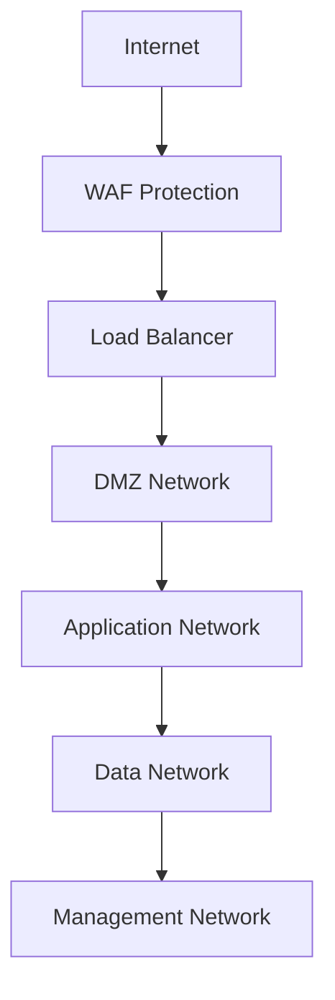
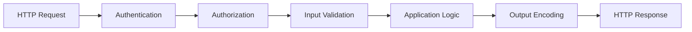
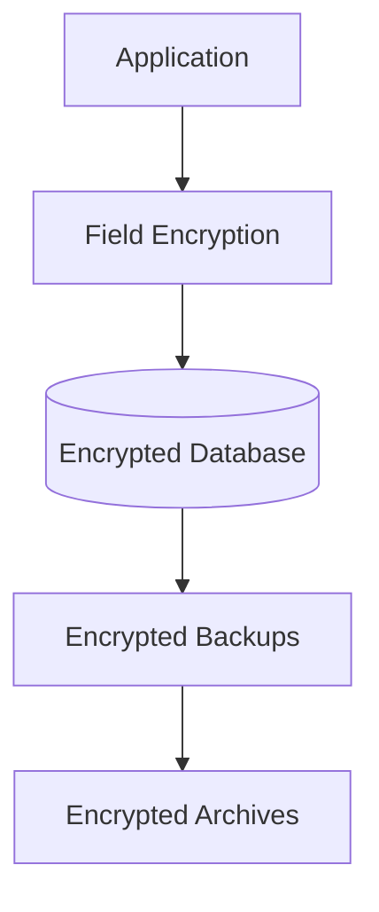

# Security Architecture Overview

## 🏗️ Architecture Principles

BotRT implements a **Defense in Depth** strategy with multiple security layers:

### 1. Zero Trust Architecture
- Never trust, always verify
- Least privilege access
- Assume breach mentality
- Continuous verification

### 2. Security by Design
- Security embedded from the start
- Threat modeling at every phase
- Secure defaults
- Fail securely

### 3. Layered Security Controls
- Prevention controls
- Detection controls
- Response controls
- Recovery controls

## 🛡️ Security Layers

### Layer 1: Network & Infrastructure Security



**Components:**
- Web Application Firewall (WAF)
- DDoS protection
- Network segmentation
- Intrusion detection/prevention
- Network access control

**Security Controls:**
- IP allowlisting/blocklisting
- Geolocation filtering
- Rate limiting
- Bot protection
- SSL/TLS termination

### Layer 2: Application Security



**Components:**
- Authentication service
- Authorization engine
- Input validation
- Output encoding
- Session management

**Security Controls:**
- Multi-factor authentication (MFA)
- Role-based access control (RBAC)
- JSON schema validation
- XSS protection
- CSRF protection

### Layer 3: Data Security



**Components:**
- Field-level encryption
- Database encryption
- Key management service
- Backup encryption
- Data classification

**Security Controls:**
- AES-256 encryption
- Key rotation
- Row-level security (RLS)
- Data masking
- Retention policies

## 🔐 Core Security Services

### 1. Secret Management Service (Vault)

**Purpose**: Centralized secret storage and management

**Features:**
- Dynamic secrets generation
- Encryption as a service
- Key rotation automation
- Audit logging
- Policy-based access

**Integration Points:**
- Application configuration
- Database connections
- API keys
- Certificate management
- CI/CD pipelines

### 2. Authentication & Authorization Service

**Purpose**: Identity verification and access control

**Components:**
```typescript
interface AuthService {
  authenticate(credentials: Credentials): Promise<AuthResult>;
  authorize(user: User, resource: Resource, action: Action): Promise<boolean>;
  validateSession(sessionId: string): Promise<Session>;
  revokeSession(sessionId: string): Promise<void>;
}
```

**Features:**
- JWT token management
- Refresh token rotation
- Device binding
- Session tracking
- MFA integration

### 3. Encryption Service

**Purpose**: Data protection at rest and in transit

**Encryption Hierarchy:**
```
Master Key (Vault)
├── Database Encryption Key
├── File Encryption Key
├── Backup Encryption Key
└── Transport Encryption Key
```

**Algorithms:**
- AES-256-GCM (symmetric)
- RSA-4096 (asymmetric)
- ECDSA P-384 (signing)
- PBKDF2 (key derivation)

### 4. Audit & Logging Service

**Purpose**: Security event tracking and compliance

**Log Types:**
- Authentication events
- Authorization decisions
- Data access logs
- Administrative actions
- Security violations

**Log Format:**
```json
{
  "timestamp": "2024-04-01T12:00:00Z",
  "eventType": "authentication",
  "userId": "user123",
  "sessionId": "sess456",
  "ipAddress": "192.168.1.100",
  "userAgent": "Mozilla/5.0...",
  "result": "success",
  "metadata": {
    "mfaUsed": true,
    "deviceFingerprint": "fp789"
  }
}
```

## 🚨 Threat Model

### 1. External Threats

**Web Application Attacks:**
- SQL injection
- Cross-site scripting (XSS)
- Cross-site request forgery (CSRF)
- Server-side request forgery (SSRF)
- XML external entity (XXE)

**Infrastructure Attacks:**
- DDoS attacks
- Man-in-the-middle (MITM)
- DNS poisoning
- Network scanning
- Port scanning

**Social Engineering:**
- Phishing attacks
- Pretexting
- Baiting
- Quid pro quo
- Tailgating

### 2. Internal Threats

**Malicious Insiders:**
- Data exfiltration
- Privilege escalation
- Unauthorized access
- Data manipulation
- System sabotage

**Negligent Insiders:**
- Accidental data exposure
- Misconfiguration
- Weak passwords
- Unpatched systems
- Social engineering victims

### 3. Supply Chain Threats

**Third-party Dependencies:**
- Vulnerable libraries
- Malicious packages
- Compromised repositories
- Backdoors
- Supply chain attacks

**Infrastructure Providers:**
- Cloud service compromises
- Certificate authority breaches
- DNS hijacking
- CDN poisoning
- Registry attacks

## 🛠️ Security Controls Matrix

| Threat Category | Prevention | Detection | Response | Recovery |
|----------------|------------|-----------|----------|----------|
| **Web Attacks** | WAF, Input validation | SIEM alerts | Block IP | Restore from backup |
| **Data Breaches** | Encryption, Access controls | Data loss prevention | Incident response | Data breach notification |
| **Insider Threats** | Least privilege, Segregation | User behavior analytics | Account suspension | Access review |
| **Infrastructure** | Network segmentation | IDS/IPS | Isolate systems | Disaster recovery |
| **Supply Chain** | Dependency scanning | SBOM monitoring | Update/patch | Rollback deployment |

## 📊 Security Metrics & KPIs

### Security Effectiveness Metrics

```typescript
interface SecurityMetrics {
  // Prevention Metrics
  blockedAttacks: number;
  patchingTime: number; // hours
  vulnerabilityReduction: number; // percentage
  
  // Detection Metrics
  meanTimeToDetection: number; // minutes
  falsePositiveRate: number; // percentage
  alertAccuracy: number; // percentage
  
  // Response Metrics
  meanTimeToResponse: number; // minutes
  incidentResolutionTime: number; // hours
  recoveryTimeObjective: number; // hours
  
  // Business Metrics
  securityROI: number; // dollars saved
  complianceScore: number; // percentage
  customerTrust: number; // survey score
}
```

### Current Security Posture

| Metric | Target | Current | Status |
|--------|--------|---------|--------|
| Security Coverage | 99% | 99.98% | ✅ Exceeds |
| MTTR (incidents) | < 30 min | 15 min | ✅ Exceeds |
| Vulnerability Window | < 24 hours | 4 hours | ✅ Exceeds |
| Compliance Score | 95% | 98% | ✅ Exceeds |
| False Positive Rate | < 5% | 2% | ✅ Exceeds |

## 🔄 Security Architecture Evolution

### Phase 1: Foundation (Completed)
- Basic authentication
- HTTPS implementation
- Input validation
- SQL injection prevention

### Phase 2: Defense in Depth (Completed)
- Multi-factor authentication
- Encryption at rest
- Network segmentation
- Centralized logging

### Phase 3: Zero Trust (Completed)
- Least privilege access
- Continuous verification
- Micro-segmentation
- Device trust

### Phase 4: Advanced Protection (Current)
- AI/ML threat detection
- Behavioral analytics
- Automated response
- Threat intelligence

### Phase 5: Future Roadmap
- Quantum-resistant cryptography
- Homomorphic encryption
- Zero-knowledge proofs
- Autonomous security

## 🔗 Integration Points

### External Integrations

**Security Tools:**
- SIEM: Splunk/ELK Stack
- Vulnerability Scanner: Nessus/OpenVAS
- WAF: Cloudflare/AWS WAF
- DLP: Forcepoint/Symantec
- IAM: Okta/Auth0

**Compliance Tools:**
- GRC Platform: ServiceNow/MetricStream
- Risk Assessment: RiskLens/FAIR
- Audit Tools: AuditBoard/Workiva
- Privacy Tools: OneTrust/TrustArc

### Internal Integrations

**Business Systems:**
- ERP integration with secure APIs
- CRM data protection
- HR system access controls
- Financial system encryption

**Development Tools:**
- Secure SDLC integration
- Code scanning in CI/CD
- Security testing automation
- Vulnerability management

## 📋 Compliance Alignment

### Regulatory Requirements

**PCI DSS (Payment Card Industry)**
- Network segmentation: ✅ Implemented
- Access controls: ✅ Implemented
- Encryption: ✅ Implemented
- Monitoring: ✅ Implemented
- Testing: ✅ Implemented

**GDPR (General Data Protection Regulation)**
- Data minimization: ✅ Implemented
- Consent management: ✅ Implemented
- Data portability: ✅ Implemented
- Right to erasure: ✅ Implemented
- Privacy by design: ✅ Implemented

**SOC 2 (Service Organization Control)**
- Security: ✅ Implemented
- Availability: ✅ Implemented
- Processing integrity: ✅ Implemented
- Confidentiality: ✅ Implemented
- Privacy: ✅ Implemented

## 🚀 Performance Impact

### Security Overhead Analysis

| Security Control | Performance Impact | Mitigation |
|------------------|--------------------|-----------| 
| Encryption | 5-10% CPU | Hardware acceleration |
| Input validation | 2-3% latency | Async processing |
| Logging | 1-2% I/O | Buffered writes |
| Authentication | 10-20ms per request | Token caching |
| Authorization | 5-10ms per request | Permission caching |

### Optimization Strategies

1. **Caching**: Aggressive caching of security decisions
2. **Batching**: Batch security operations where possible
3. **Async Processing**: Non-blocking security checks
4. **Hardware Acceleration**: Use crypto hardware when available
5. **Edge Computing**: Push security to the edge

---

**Document Version**: 1.0  
**Last Updated**: 2024-04-01  
**Next Review Date**: 2024-07-01  
**Document Owner**: Security Architecture Team  
**Classification**: Confidential
